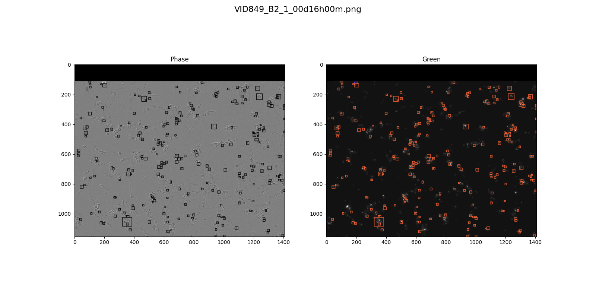

# CellDetection
Repository for died cell detection with apoptosis and necroptosis distinction. It provides training and inference pipelines for training cell detection model as well as all needed data preparation steps.

## cell_adjustor
Contains cell adjustor script that enables us to check parameters of cell images labeling process.
Here are also all the data preprocessing/managment scripts used to prepare the dataset.

### Setup
Python version required: 3.9.*
#### Mac
Install requirements with:    
`pip install -r requirements_cell_mac.txt`
#### Ubuntu
Install requirements with:    
`pip install -r requirements_cell.txt`

## yolo
Yolo training pipeline with custom model wrapper and inference example.
### Setup
Python version required: 3.8.*
#### Mac
Install requirements with:    
`pip install -r requirements_ultralytics_mac.txt`
#### Ubuntu
Install requirements with:    
`pip install -r requirements_ultralytics.txt`
### Example output
